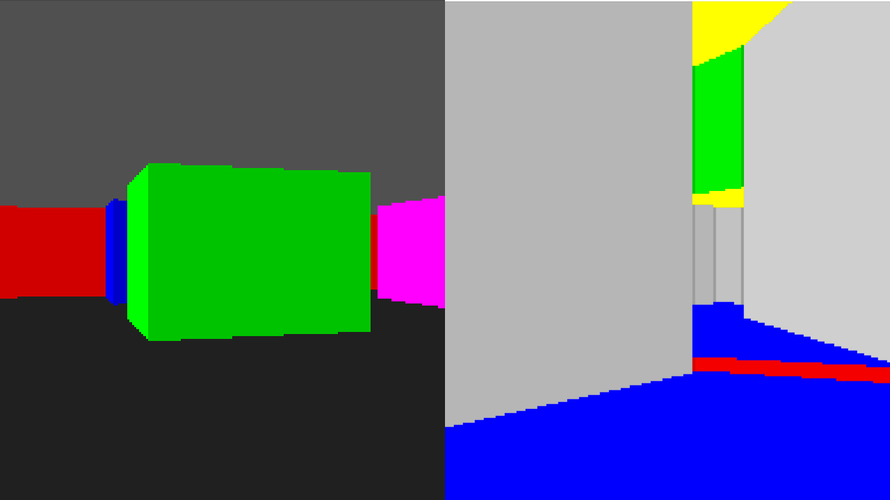

# Wolfenstein/DOOM style software renderers

* `src/main_doom.c`: a DOOM-style software renderer
* `src/main_wolf.c`: a Wolfenstein 3D-style software renderer

### Building & Running

`$ make doom|wolf|all`, binaries are `bin/doom` and `bin/wolf` respectively
